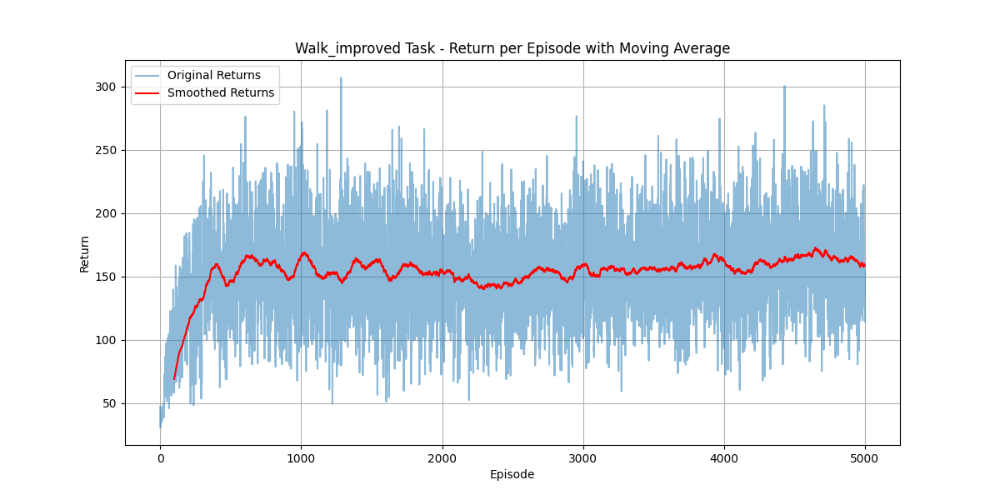

# PPO in dm_control

This repository contains an implementation of Proximal Policy Optimization (PPO) using the DeepMind Control Suite (dm_control) for continuous control tasks.

### Summary of "The 32 Implementation Details of PPO"

[The 32 Implementation Details of PPO](https://costa.sh/blog-the-32-implementation-details-of-ppo.html)

In this article, the author provides a detailed overview of 32 implementation details of the Proximal Policy Optimization (PPO) algorithm, which significantly impact its performance. Here are some key points summarized:

1. **Network Architecture**: Using a smaller network architecture (e.g., two layers with 64 units each) generally works better.
2. **Activation Function**: The Tanh activation function performs well in most cases.
3. **Initialization**: Orthogonal initialization can improve stability.
4. **Optimizer**: The Adam optimizer is a good choice, especially with an epsilon parameter set to 1e-5.
5. **Learning Rate**: The choice of learning rate is crucial, typically ranging from 3e-4 to 1e-5.
6. **Learning Rate Decay**: Using learning rate decay can further enhance performance.
7. **Batch Size**: Larger batch sizes (e.g., 2048) help stabilize training.
8. **Discount Factor**: The choice of discount factor gamma significantly affects long-term returns, usually set to 0.99.
9. **GAE Parameter**: The GAE (Generalized Advantage Estimation) parameter lambda is typically set to 0.95.
10. **Normalization**: Normalizing advantages, states, and rewards helps improve performance.
11. **Reward Scaling**: Reward scaling generally has a negative impact on performance.
12. **Policy Entropy**: Increasing policy entropy can prevent premature convergence, but too much entropy can degrade performance.
13. **Gradient Clipping**: Gradient clipping can prevent gradient explosion and improve training stability.
14. **PPO Clip Parameter**: The PPO clip parameter is usually set to 0.2.
15. **Training Steps**: The number of training steps per update is typically set to 80.

These implementation details may vary across different environments and tasks, but overall, these recommendations serve as a guideline for implementing the PPO algorithm.

For more detailed information, please refer to the original article: [The 32 Implementation Details of PPO](https://costa.sh/blog-the-32-implementation-details-of-ppo.html)

More discussion about the PPO algorithm can be found in [this article](https://www.reddit.com/r/reinforcementlearning/comments/s1h7c1/how_to_improve_ppo_on_bipedalwalkerv3/).

### My Test 

- **Advantage, State, Reward Normalization**: Positive impact.
- **Reward Scaling**: Negative impact.
- **Policy Entropy**: Negative impact.
- **Learning Rate Decay**: Positive impact.
- **Gradient Clip**: Positive impact.
- **Orthogonal Initialization**: Neutral impact.
- **Adam Optimizer Epsilon Parameter**: Neutral impact.
- **Tanh Activation Function**: Positive impact.

This project highlights the importance of these techniques in improving the performance of PPO in continuous control tasks.

## Requirements

- Python 3.8+
- PyTorch 1.7+
- dm_control
- gym
- numpy
- scipy
- pickle
- matplotlib

dm_control refers to the [DeepMind Control Suite](https://github.com/google-deepmind/dm_control).

